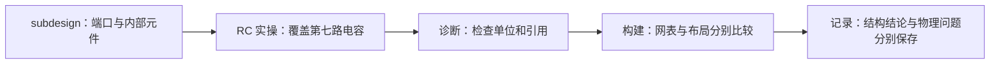

# 三个贯穿示例

下面是跨章节的理解路径，描述应当怎样追踪一次操作；不是已经执行完成的实板报告。

## 移动一个电阻

```text
第 1 课：查询 R1 的 pin / pad / net
    ↓
第 2 课：移动封装，读取新坐标，保存 PCB
    ↓
构建章节：逻辑 net 可不变，铜连接要重新检查
    ↓
学习记录：写下新增问题、修复与重检
```

在 [第 1 课](../course/01-read-board.md)先确定 R1 两端的关系。[第 2 课](../course/02-edit-check.md)改变物理位置，观察同一 net 归属与实际铜端点可以产生不同结果。[构建章节](../cohdl/pipeline.md)解释为什么源码检查不能代替本次 PCB 检查。

Konnect 的对应实现位于 [pcb_components.rs](https://github.com/mixelpixx/Konnect/blob/1f96aad/crates/konnect-core/src/tools/pcb_components.rs)，CoHDL 的逻辑展开位于 [check/expand.rs](https://github.com/conol-ai/cohdl/blob/9ac0e3c/src/check/expand.rs)。两者读写对象不同，学习记录要把对象和版本写清楚。

## 修改一项电源需求

```text
第 5 课：确认实际显示模组及供电要求
    ↓
第 6 课：更新模式负载、适用拓扑和计算
    ↓
M3/M4：区分现有显式选料、未来配方与条件检查
    ↓
第 7 课：重新检查板和制造文件，装配后测量
```

[手表原型](../course/05-watch-prototype.md)先确定实际模组；[电源课程](../course/06-power-contracts.md)获得电压范围与工作模式。[语言里程碑](../cohdl/milestones.md)解释哪些计算与条件尚需研发，现阶段可先用明确的 part 与人工核算。

当前 [bind_parts](https://github.com/conol-ai/cohdl/blob/9ac0e3c/src/emit/mod.rs)执行精确绑定，并不是完整电源优化器。实际 [SF32 源码](https://github.com/conol-ai/cohdl/blob/9ac0e3c/examples/sf32-miniboard/src/main.cohdl)保存连接与规格；改变源设计后，还要按 [制造与测试](../course/07-production-test.md)重新核对实际板、输出和测量。

两条路径的原始结果都使用 [记录模板](../learning/template.md)保存；概念解释分别回到对应知识章节，避免让每一篇实验记录重复整套背景。


## RC 的一次改动如何走过三类知识



先在[subdesign](../cohdl/subdesign.md)理解内部器件和对外端口，再沿[RC 实操](../course/03-rc-workflow.md)从十路扩到十二路。[诊断指南](../cohdl/diagnostics.md)解释错误码及 check 通过的反例，[构建章节](../cohdl/pipeline.md)解释文件与实际 PCB 的区别。

这条路径已有自动实验：源码在 `docs/proposals/fixtures/m2-programmability/rc-workflow/`，展开规则见[固定 main 的 expand.rs](https://github.com/conol-ai/cohdl/blob/0e3d770/src/check/expand.rs)。本次保留了实例位号与位置，但未执行布线、物理检查或硬件测量；结果见[实际记录](../learning/2026-09-10-book-review-repair.md)。
