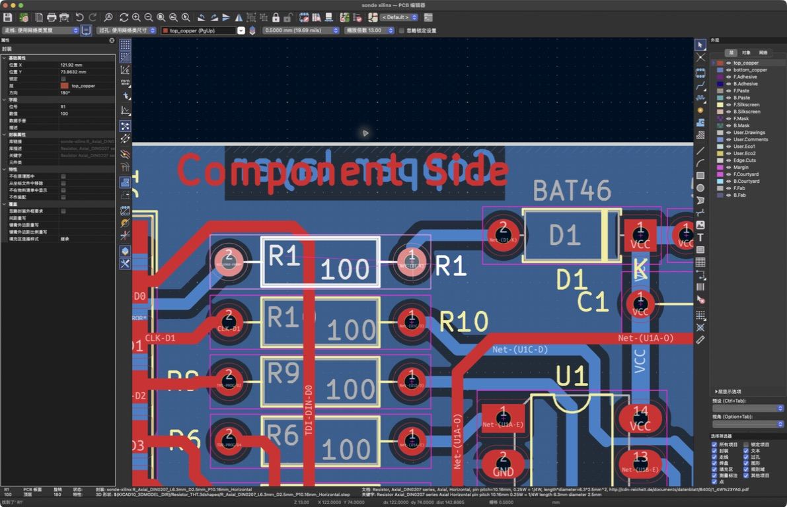
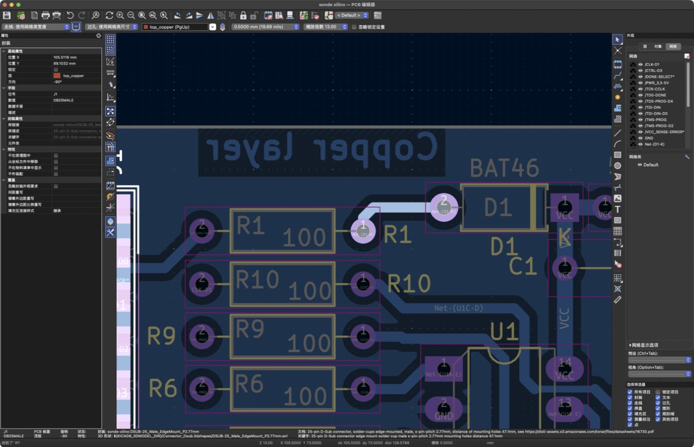
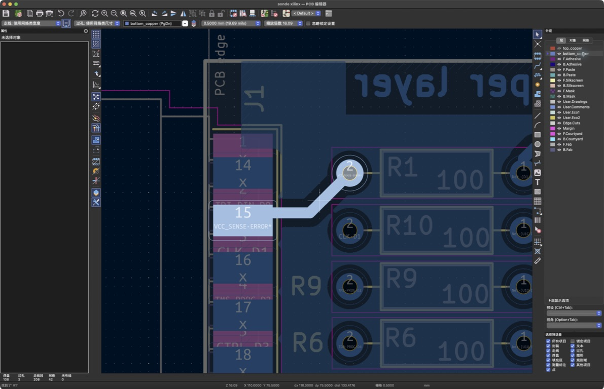
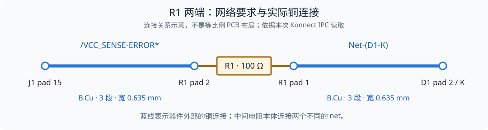

# 第 1 课：看懂一条连接

已有完整案例：[Sonde 整板解读](01-sonde-circuit.md) → [用 CoHDL 描述并检查](../cohdl/sonde-case.md)。如果刚开始认焊盘，仍可先按本页的 R1 小步骤学习，再读整板。

> **本课目标**：在 PCB 画面中指出 R1、它的两个焊盘，以及通向另一个器件的铜走线。前置：[第 0 课](00-workbench.md)。技术核对已有证据；用户反馈尚未看懂，当前从画面重新分步学习。

打开 `sonde xilinx` 练习副本，先找到电阻 R1。不要急着理解整块板；本课只追踪它的两端。

## 先知道这块板用来做什么

这个 demo 的原理图标题是 **PARALLEL CABLE III**。它是一块老式 Xilinx 下载器接口板，接在电脑的并口（以前常用于接打印机）和 FPGA 目标板之间。FPGA 是一种可以通过配置数据改变内部数字电路的芯片；下载器帮助电脑把这些数据送入目标器件，并读回状态。Parallel Cable III 通过电脑并口与目标板通信的用途，见 [Xilinx ChipScope Pro 用户指南第 42 页](https://docs.amd.com/api/khub/documents/jTy2Pwg8odiavQf4ellMvQ/content#page=42)。

`电脑 ↔ J1 接口 ↔ 板上的信号缓冲电路 ↔ J2/P1 接口 ↔ FPGA 目标板`

| 当前板上的部分 | 在整板中的作用 |
| --- | --- |
| J1，25 针连接器 | 接电脑的并口，收发控制、数据和状态信号 |
| U1、U2，图中标为 74LS125 | 缓冲数字信号，并按控制信号启用或释放输出 |
| J2、P1 | 连接目标板，提供数据、时钟、控制、供电及地的连接点 |

本地导出网表记录了上述器件、接口和网名，见 [用途核对数据](../learning/evidence/2026-09-08-sonde-function.json)。125 系列缓冲器的输出控制含义可对照 [TI 的 SN74LS125A 说明](https://www.ti.com/product/SN74LS125A)；具体电气条件仍需核对实际器件。

刚才追踪的 R1、D1 所在支路连接 `VCC → D1 → R1 → J1.15`，J1 一端的网名是 `/VCC_SENSE-ERROR*`。结合连接关系和这个标签，可判断其设计用途是把供电存在状态送回电脑。这是对电路用途的解释，没有进行电压测量或下载测试。

本课用它练习认器件、焊盘和铜线。先知道“电脑通过它与另一块板通信”就够了；后续手表课程再把读图方法用于电源、主控、屏幕和传感器这些功能区。

## 第一次学，先跟着画面看

本课先学三个具体对象：**电阻的安装位置、焊盘、铜走线**。能在画面中指出它们后，再读后面的网络和工具解释。

### 第一步：认出 R1 的两个焊盘



看图中被白色边框选中的 R1，它在 R10 的上方。这个画面是 PCB 设计图，展示器件将来安装的位置。

R1 中间的空白区域用于放置电阻本体；两根引脚分别伸向左右两个孔，插入后与孔周围的金属焊盘焊接。实际焊接点在两侧焊盘上，中间的轮廓帮助你理解器件的安装位置。

- **R1** 是电阻的编号，用来区别其他电阻。
- **100** 是这个电阻的值，表示 100 ohm。
- 左右两个带孔的圆环叫 **焊盘**。焊接这只直插电阻时，它的两根引脚分别插进两个孔，并焊在孔周围的金属上。
- 在本次画面方向下，**左边标 2，右边标 1**。编号跟着器件的封装定义，不按画面的左右重新编号。

**焊盘到底是什么？** 焊盘是电路板上专门用来焊接元件引脚的一小块金属。电阻还没有装上时，焊盘就已经在板子上了。以这只 R1 为例，想象实际安装过程：

1. 空电路板上已经做好两个孔，孔周围各有一圈金属，这两圈金属就是这里看到的焊盘。
2. 把实物电阻的两根金属脚分别插进孔里。
3. 用焊锡把每根脚与周围的焊盘焊在一起，既固定元件，也形成电气连接。焊盘再通过板上的铜走线连接其他位置。

带孔圆环是本例的形状。贴片元件常焊在没有孔的矩形焊盘上，所以“有孔”不是焊盘的必要条件。

操作示范：查找 `R1`，启用全字匹配，点击查找下一项，关闭查找框；在缩放下拉框选择 13.00。缩放值是这次显示环境的操作记录，其他屏幕以能看清两个编号为准。

**如果觉得下面还有一个 R1**：下面其实是 R10，框内编号的末尾 0 被红色铜走线挡住了，右侧黄色位号仍是完整的 R10。在右侧层面板暂时关闭 `top_copper` 的可见性，就能看清框内完整编号。隐藏图层只改变画面，不会删除铜线。同一器件的编号也可能在不同图层上重复显示，不能按文字出现次数来数器件。实际对照见 [本次学习记录](../learning/2026-09-08-r1-step-by-step.md#r1-下面为什么看起来还有-r1)。

**停在这里**：请学习者指出两个焊盘，说明实物电阻的两根脚将焊在哪里。如果还看不清，保持同一对象继续说明，不自动转到检查报告。

### 第二步：只沿右边的焊盘找 D1

认出两个焊盘后，再从 R1 的右边焊盘 1 出发，观察连接到 D1 焊盘 2 的铜走线。一次只高亮或展示这一条路径；先说“从哪里到哪里”，再解释它属于哪一层、叫什么网络名。



本次实际操作：右侧“外观”面板 → “网络”页签 → 右键 `Net-(D1-K)` → “高亮 Net-(D1-K)”。R1 右焊盘 1 和 D1 左焊盘 2 一起亮起，中间浅蓝色铜线从 R1 向上拐弯，再向右到 D1。做成实物后，这段铜像导线一样连接两个器件各自的一只脚。这个跟随顺序只是看图顺序，不表示电流方向。高亮是显示操作，不会新建连接；这段铜已经存在，并已通过 Konnect 查询核对。

**停在这里**：请学习者在画面中指出起点、终点，以及中间连接它们的铜。随后再看 R1 左边焊盘 2 通向 J1 的路径。



另一端的操作：先调整视角使 J1 和 R1 同时可见，在“网络”页签右键 `/VCC_SENSE-ERROR*` 并高亮，再在“层”页签选择 `bottom_copper`，看清底层的焊盘编号。图中左边亮起的长方形是 J1 焊盘 15，右边亮起的圆环是 R1 焊盘 2，中间是铜走线。焊盘可以有不同形状。

把两次观察连起来读：`J1.15 — 铜线 — R1.2 [100 ohm 电阻] R1.1 — 铜线 — D1.2`。这里的 `器件编号.焊盘编号` 是端点的简写，两段铜分别接到电阻的两只脚；这个排列不表示电流方向。

### 第三步：用自己的话说出来

能解释“器件的脚焊在焊盘上，铜走线连接不同器件的焊盘”，本课的画面识别才有学习者证据。再引入 `net`：它记录哪些端点应当相连，实际铜是连接的实现。DRC 与 CoHDL 对应知识放在这个直观认识之后。

2026-09-08 的重新示范记录见 [从 R1 重新开始](../learning/2026-09-08-r1-step-by-step.md)。以下内容保留为进阶解释和已执行检查的参考，不要求初学者一次读完。

## 先认识五个对象

**原理图符号是什么？** 它是在电路图中代表元件的简化图形。以电阻 R1 为例，可以用一个小长方框表示电阻，两端伸出的线表示引脚在图中的连接端点：

```text
       R1
 1 ──[    ]── 2
      100 Ω
```

这是解释概念的示意，不是当前原理图的实际截图。R1 是编号，100 Ω 是阻值，1、2 是引脚编号。原理图用这些端点画出电气连接，图形便于阅读即可；元件的实际尺寸和安装位置由 PCB 上的封装与布局表达。

同一只 R1 有三个观察角度：实物电阻是拿在手里的元件；原理图符号用简化图形表达它的引脚与连接；PCB 封装给出焊盘、间距和安装相关图形。此前在 PCB 编辑器里看到的两个带孔焊盘属于第三种。

| 对象 | 本课中的问题 |
| --- | --- |
| Symbol，原理图符号 | 图上哪一个符号表示 R1？ |
| Pin，引脚 | R1 的哪一端是 1，哪一端是 2？ |
| Footprint，封装焊盘图形 | PCB 上哪组焊盘和图形属于 R1？ |
| Pad，焊盘 | PCB 上的 pad 1 对应哪个原理图 pin？ |
| Net，网络 | 这个 pin 应当与哪些其他 pin 电气相连？ |

走线是实现连接的铜几何；网络描述应当相连的一组端点。一个 net 可以由多段走线、过孔和铜区实现。术语集中解释在 [术语表](../appendix/glossary.md)，CoHDL 对应关系见 [连接模型](../cohdl/connections.md)。

## 三种读取结果各回答什么

| 结果 | 回答的问题 | 读的时候注意 |
| --- | --- | --- |
| 板信息 `get_board_info` | 这是哪块板，有什么标题、版本、层数和网络数量？ | 查看 `source`，区分 IPC 内存状态与已保存文件；纸张规格不等于板外形尺寸 |
| 器件清单 `get_component_list` | PCB 上放了哪些封装，各自的位号、值、位置和层是什么？ | R1 是位号，阻值是值，封装描述焊盘几何；清单本身不保证有可采购料号 |
| 网络清单 `get_nets_list` | 当前板有哪些电气连接网络？ | 这个工具需要 IPC；具体焊盘归属继续用 `get_component_pads` 核对，网名不能证明铜已接通 |

CoHDL 的 `inst` 与 `net` 分别帮助描述器件实例和连接要求，封装、焊盘与布局还涉及其他声明和输出。先在 KiCad 中认识这些对象，再对照 [连接模型](../cohdl/connections.md)，不要把一张器件清单当成完整的 CoHDL 源码。

本次 [首次实时读板](../learning/2026-09-07-first-live-board.md) 返回 25 个封装、2 个铜层、42 个非空网络。有三处需要按字段含义理解：

- `layer_count: 20` 包括铜层、丝印、阻焊、板边等图层；`copper_layer_count: 2` 才说明它是双面铜板。
- `get_nets_list.count: 43` 包括 `netcode: 0, name: ""` 的无网络条目；板信息的 `net_count: 42` 排除了它。16 个 `unconnected-…` 命名条目仍在这 42 个中，它们与空名字的编号 0 不同，不能仅凭名字推断全部连接检查的结论。
- R1 的通孔焊盘层集合列出了 `In1.Cu` 到 `In30.Cu`，这是工具返回的焊盘层集合；实际启用的铜层仍只有 2 层。不要用这段列表推断板子有 32 个铜层。

## 从已经读取的网表出发

本次对原始 demo 的 KiCad XML 网表读取到以下关系：

| R1 端点 | 网络 | 同网的另一个端点 |
| --- | --- | --- |
| R1 pin 1 | `Net-(D1-K)` | D1 pin 2，阴极 K |
| R1 pin 2 | `/VCC_SENSE-ERROR*` | J1 pin 15 |

这是原理图连接关系。接下来要在你的练习 PCB 中核对对应焊盘与铜，不能用这张表代替 PCB 检查。若副本已修改，先记录差异。

2026-09-07 的 IPC 实读已核对练习副本的 R1 pad 1 / D1 pad 2 同为 `Net-(D1-K)`，R1 pad 2 / J1 pad 15 同为 `/VCC_SENSE-ERROR*`，与上表一致。GUI 的完整位号查找也定位到了 R1。后续的 [铜连接与检查基线](../learning/2026-09-07-copper-and-checks.md) 已补充实际走线和 DRC 证据，见下文。

对 AI 说：

> 在当前练习板中定位 R1，用 `get_component_pads` 读取每个焊盘的编号、坐标、层和网络。再查询 D1 的 pad 2 与 J1 的 pad 15，比较网络。请把工具读到的事实和你对电路用途的推断分开说明。

在 KiCad 中选择 R1，查看属性和焊盘编号；按需使用网络高亮查看连接。若需要层图，让 Konnect 使用 `export_svg`。`get_board_2d_view` 是从顶面看的三维渲染，不是指定铜层的布线图。

## 先预测，再查看铜

在查看走线前回答：

1. R1 pin 1 与 D1 pin 2 属于同一 net，是否已经足以证明 PCB 上有连续铜连接？
2. 网络名为 `Net-(D1-K)`，是否意味着这个网只有两个端点？
3. R1 的 pin 1 与 pin 2 是否属于同一个 net？

第一题需要实际铜连接或适用的 DRC 证据；第二题必须查完整成员；第三题从当前网表可见它们属于不同网络。电阻内部的电气关系与板外连接是两个层次。

让 AI 用 `query_traces` 查看相关网的走线，再与你在 GUI 中看到的铜对照。这里不从网络名字推断信号电压或完整电流方向；这些需要电路工作条件。

## 实际走线给出的答案



本次两条网各返回 **3 段 `B.Cu` 走线**，宽度均为 **0.635 mm**。按坐标排序后，每条网的三段都能首尾接起来；D1 一侧从 R1 pad 1 中心接到 D1 pad 2 中心。J1 一侧的末端与 pad 15 中心相差约 0.0626 mm，KiCad 当前规则检查没有报告未连接项。

不要把“走线端点必须等于焊盘中心”当作连接判据。铜线与焊盘有面积，末端可以偏离中心仍与焊盘铜接触。本例的判断结合了实际几何、相同铜层及 DRC；它不是只比较两个坐标是否完全相等。详细坐标和覆盖范围见 [本次记录](../learning/2026-09-07-copper-and-checks.md)。

再看 IC 电源端：U1 pad 14 属于 `VCC`，两段底层走线经过 C1 pad 1，连到 D1 pad 1。此处只确认连通关系；没有测量电压，也不能据此确定电源电流能力或去耦效果。

## 写下自己的映射表

| 原理图端点 | PCB reference / pad | 工具返回的 net | 所见铜连接 |
| --- | --- | --- | --- |
| R1 pin 1 | 实操填写 | 实操填写 | 实操填写 |
| D1 pin 2 | 实操填写 | 实操填写 | 实操填写 |
| R1 pin 2 | 实操填写 | 实操填写 | 实操填写 |
| J1 pin 15 | 实操填写 | 实操填写 | 实操填写 |

再任选一个 IC 的电源 pin，按相同方法追到网络和焊盘。引脚功能以实际符号和器件资料为准。

## 本课完成条件

你能解释：“net 表示连接要求，pad 是物理连接点，铜走线实现这些连接。”至少核对 R1 两端及一个相连器件，保存原理图/PCB 对照和工具结果。更新 [学习进度](../learning/progress.md)，把复述写进 [记录](../learning/template.md)。

下一课：[修改、检查与修复](02-edit-check.md)。本课读取基线和证据边界见 [课程起点](../learning/2026-09-07-start.md)。
