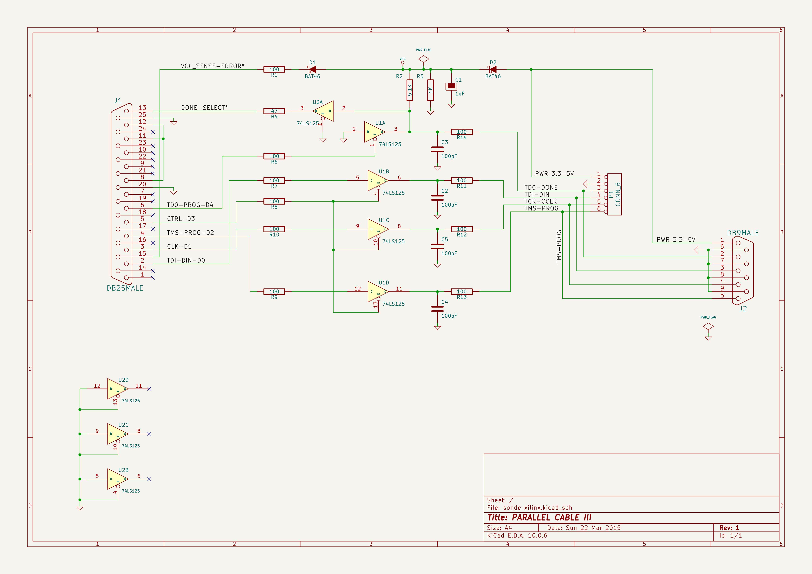

# 整板解读：Sonde 并口下载接口

> **定位**：把已经看到的 R1 放回完整电路，沿供电、输出和回读三条线理解整板。前置：[器件、符号与焊盘](01-read-board.md)。依据是 2026-09-08 从练习副本实际导出的原理图、网表和 IPC 焊盘信息；本章提供讲解，学习者独立认图与实物测试尚未完成。

**本案例分两页：当前页看懂电路；[下一页直接看 CoHDL 源码、检查和编译结果](../cohdl/sonde-case.md)。**

这块板的原理图标题是 **PARALLEL CABLE III**。它连接老式电脑并口与外部 Xilinx 目标板，传递配置、控制和状态信号。电脑负责产生操作序列，目标板上才有待配置的 FPGA；眼前这块接口板主要做信号缓冲、使能控制和供电检测。历史用途参照 [Xilinx ChipScope Pro 用户指南，第 42 页](https://docs.amd.com/api/khub/documents/jTy2Pwg8odiavQf4ellMvQ/content#page=42)。本 demo 的具体电气条件仍以它自己的器件和连接为准。

```text
电脑并口 J1                         外部目标板
    ├── 数据、时钟、模式 ── U1 ──── P1 或 J2
    ├── 使能、拉低控制 ─── U1          │
    └── 状态反馈 ◀─────── U2 ◀─────────┘
           电源检测 ◀── D1、R1
                          ▲
             目标侧电源 ── D2 ── 内部 VCC
```

先看下面实际原理图的左、中、右三个区域，再读逐条解释。原理图中标在导线旁的同名网络标签表示连接；交叉线处的圆点表示连接，不能仅凭两条线在画面上交叉就认定导通。

[](../learning/evidence/2026-09-08-sonde-full/sonde%20xilinx.svg)

点击图片可打开可放大的 SVG。**这张原理图由 KiCad 10.0.6 从练习副本的 `.kicad_sch` 文件直接导出**，代理通过 Konnect 调用 `export_schematic_svg`，没有重画电路。章节开头的简化文字框图则是教学归纳。引脚号以[本次导出网表](../learning/evidence/2026-09-08-sonde-full/sonde.net)为准，图中文字朝向不会改变引脚号。

第一次看这张图，先在左侧找到高高的 J1；再在中间找到 U1 的四个三角形和 U2A；然后在右侧找到 P1 与 J2，确认信号要走向哪里。最后在图的上方找到 D2 以及 VCC 文字，辨认供电入口。下面先用清单查名字，再按“供电 → 三路输出 → 回读”走一遍；暂时不必记住所有脚号。

## 25 个元件分别做什么

| 元件 | 数值 / 型号 | 在本板中的作用 |
| --- | --- | --- |
| J1 | DB25MALE，25 针 | 电脑并口侧接口 |
| J2 | DB9MALE，9 针 | 目标板接口，与 P1 的对应信号直接相连 |
| P1 | CONN_6，6 针 | 另一种目标板接线形式 |
| U1、U2 | 74LS125，各 14 脚 | 每颗包含四个可使能的数字缓冲门 |
| D1 | BAT46 | 供电检测支路中的单向导通器件 |
| D2 | BAT46 | 目标电源到内部 VCC 的串联二极管 |
| C1 | 1 µF，有极性符号 | 跨接 VCC 与 GND 的电源电容 |
| C2、C4、C5 | 各 100 pF | 分别接在 DIN、TMS、时钟缓冲输出的内部节点与地之间 |
| C3 | 100 pF | 接在目标回读 / 受控拉低公共节点与地之间 |
| R1 | 100 Ω | 供电检测支路的串联电阻 |
| R2 | 5.1 kΩ，原图写 `5,1K` | 公共回读节点到 VCC 的上拉电阻 |
| R4 | 47 Ω | U2A 输出到 J1 状态输入的串联电阻 |
| R5 | 1 kΩ | 直接跨接 VCC 与 GND 的负载电阻 |
| R6 | 100 Ω | J1 到 U1A 使能脚的串联电阻 |
| R7、R10、R9 | 各 100 Ω | 分别位于 DIN、时钟、TMS 的缓冲输入侧 |
| R8 | 100 Ω | 共用使能信号到 U1B/C/D 的串联电阻 |
| R11、R12、R13 | 各 100 Ω | 分别位于 DIN、时钟、TMS 的目标接口侧 |
| R14 | 100 Ω | 目标回读接口与公共节点之间的串联电阻 |

合计：**13 个电阻、5 个电容、2 个二极管、2 个 IC、3 个连接器**。编号中没有 R3，不代表必须补装一只电阻；位号是身份，不要求连续。

## 两颗 IC 为什么在图上画了八个三角形

`U1A`、`U1B`、`U1C`、`U1D` 是同一颗 U1 内部的四个单元，实物仍是一颗 DIP-14 芯片。U2 同理。每个单元有数据输入 D、输出 O、使能 E：

| 单元 | E：使能脚 | D：输入脚 | O：输出脚 |
| --- | --- | --- | --- |
| A | 1 | 2 | 3 |
| B | 4 | 5 | 6 |
| C | 10 | 9 | 8 |
| D | 13 | 12 | 11 |

两颗 IC 都是 **14 脚接 VCC，7 脚接 GND**。这些电源脚在当前原理图的三角形上没有显示，但网表和 PCB 焊盘都有它们。

125 的使能为低有效：**E 为低电平时，输出跟随输入；E 为高电平时，输出进入高阻态**。高阻表示暂时不主动驱动线路，不等同于输出低电平。该功能及引脚排列参照 [TI SN74LS125A 数据手册，第 1–2 页](https://www.ti.com/lit/ds/symlink/sn74ls125a.pdf)。

## 电从哪里来：D2、C1、R5 与 R1/D1

本板的目标侧电源接在 P1.1 / J2.1，原网名为 `/PWR_3,3-5V`。从连接关系看，预期供电路径为：

```text
P1.1 / J2.1 → D2 的 A（1脚）→ K（2脚）→ VCC
                                                ├─ U1.14、U2.14
                                                ├─ C1.1 → C1 → GND
                                                ├─ R5.1 → R5 → GND
                                                └─ 供电检测和回读上拉支路
```

D2 串在供电路上，能限制反向回灌路径，但它不调节输出电压。导通时，内部 VCC 低于外部输入，压降随器件、电流和温度而变。BAT46 是小信号肖特基二极管；通孔器件家族的参考见 [Vishay BAT46 手册](https://www.vishay.com/docs/85662/bat46.pdf)。这份资料说明器件家族，不能反向证明 demo 采购了该厂家的具体料号。

C1 的 1 脚为正端、2 脚接地，给供电节点提供电容。R5 两端就是 VCC 和 GND，所以它始终消耗一定电流，不能把它解释为某个信号的普通下拉。**假设**内部 VCC 恰为 5 V，则 R5 电流为 `5 V / 1 kΩ = 5 mA`，功耗为 `25 mW`；这只是条件计算，未测量实板。

此前学习的 R1 属于下面这条支路：

```text
VCC → D1.A（1）→ D1.K（2）→ R1.1 → R1（100 Ω）→ R1.2 → J1.15
```

J1.15 的网络标签是 `/VCC_SENSE-ERROR*`。结合标签与拓扑，可推断其意图是向电脑反馈目标供电存在。D1 限制电脑端向 VCC 的反向供电路径，R1 提供串联阻抗。反馈电压能否被电脑正确识别，还取决于两侧电气条件；本次没有测量或运行检测软件。

这也把 R1 的三种表示连起来了：**原理图中的 100 Ω 符号，CoHDL 中有两个 pin 的电阻实例，PCB 中两枚焊盘之间安装的一只实物电阻。**

## 三条重复的输出通道

先读 DIN 这一条。下表里的箭头表示预期信号传播方向；芯片内部的输入到输出关系由器件功能实现，不是一条直接连通的铜线。

| 功能 | 完整主路径 | 输出内部节点的对地电容 |
| --- | --- | --- |
| TDI / DIN：数据 | J1.2 → R7 → U1B 输入 5 → 输出 6 → R11 → P1.4 / J2.3 | C2：U1.6 到 GND |
| TCK / CCLK：时钟 | J1.3 → R10 → U1C 输入 9 → 输出 8 → R12 → P1.5 / J2.4 | C5：U1.8 到 GND |
| TMS / PROG：模式控制 | J1.4 → R9 → U1D 输入 12 → 输出 11 → R13 → P1.6 / J2.5 | C4：U1.11 到 GND |

三条通道共用一个开关控制：**J1.5 → R8 → U1 的 4、10、13 脚**。这个使能节点为低时，三个门驱动目标侧；为高时，三个门释放输出。

串联电阻会限制瞬时电流并影响线路的阻尼；电容会增加信号节点的负载，影响边沿。这里必须看清位置：**C2/C4/C5 在芯片输出端、R11/R13/R12 之前**。因此不能把它们统一算成“100 Ω × 100 pF 的简单低通滤波器”，更不能据此推算本板可靠通信速度。驱动阻抗、线缆、目标输入和波形都需要加入分析。

这三条通道正好用于下一章的 CoHDL `fn` 复用实验：共享一种连接方式，传入不同的引脚与元件实例，展开后仍然保留三套不同的连接。

## 目标怎样回话：回读与受控拉低

回读路径从目标侧开始：

```text
P1.3 / J2.2 ↔ R14 ↔ 公共节点 → U2A 输入 2 → 输出 3 → R4 → J1.13
                        ├─ R2 → VCC
                        ├─ C3 → GND
                        └─ U1A 输出 3
```

U2A 的低有效使能 1 脚直接接地；在 U2 获得合规供电时，该门保持使能，将公共节点的逻辑状态缓冲后送到 J1.13。R2 将公共节点上拉，C3 给该节点增加对地电容。

U1A 的输入 2 脚也直接接地，但它的使能由 **J1.6 → R6 → U1.1** 控制。因此它有两种作用状态：

| U1A 使能节点 | U1A 输出 | 对公共节点的作用 |
| --- | --- | --- |
| 低 | 输出低电平 | 主动把节点拉低 |
| 高 | 高阻态 | 释放节点，让上拉和目标侧决定电平 |

这解释了它为什么既连着回读线路，又受电脑控制。它不是通常意义上“把输入数据缓冲到输出”的用法，而是利用三态门实现受控拉低。

原始网名写作 `/TD0-DONE`、`/TD0-PROG-D4`，其中是数字 **0**；结合 JTAG 名称可理解其 TDO 相关意图，代码对照仍保留原始名字的来源。斜杠名称表达旧电路的复用意图，不能单凭名字认定它适配所有目标协议。尤其当外部目标正在驱动高电平时，U1A 若主动拉低，会产生经 R14 的电流；本次没有验证控制时序与总线争用条件。

## 接口与没用上的引脚

P1 与 J2 的对应关系来自实际网表，二者并联接在同一组网络上：

| P1 引脚 | J2 引脚 | 原网名 / 含义 |
| --- | --- | --- |
| 1 | 1 | `/PWR_3,3-5V`，目标侧电源 |
| 2 | 6、7、8、9 | GND，共同参考地 |
| 3 | 2 | `/TD0-DONE`，回读 / 受控拉低相关线路 |
| 4 | 3 | `/TDI-DIN`，数据 |
| 5 | 4 | `/TCK-CCLK`，时钟 |
| 6 | 5 | `/TMS-PROG`，模式控制 |

接口外形不决定协议：本板上的 DB9 不是按常见 RS-232 串口接法使用。两个接口也不能据此当成两路独立下载器。

J1.20、J1.25 接地；**J1.8、J1.11、J1.12 相互连接**。后者结合并口数据/状态信号的关系，可能用于软件探测线缆存在；连接事实已确认，软件用途是推断。

J1 明确不连接的 13 个引脚是 **1、7、9、10、14、16、17、18、19、21、22、23、24**。U2B/C/D 的输入与使能均接地，三个输出 **U2.6、U2.8、U2.11** 标记不连接。图上的叉号表达“有意不用”，不能为了消除叉号随便接地。

因此 KiCad 的 **42 个非空网络名**，在本案例中可以拆成 **26 个有连接的网络 + 16 个显式未连接端点的单点网络**。工具若把空网络编号 0 也列出来，会返回 43 条记录。不同数字先看统计口径。

## 在 PCB 上怎样找到这些功能

本次 IPC 读到 **25 个封装、108 枚焊盘、2 个铜层**；走线查询返回 **208 个线段**，不是 208 根独立信号。可打开[当前 PCB 的层叠导出图](../learning/evidence/2026-09-08-sonde-full/board.svg)对照。

按当前板坐标看，J1 在左边，U1/U2 位于中部，P1/J2 在右边；R1、D1、R2、R5、C1、D2 集中在上部附近。三条通道的输出电阻 R11/R12/R13 靠右。原理图重在逻辑阅读，PCB 重在实际安装和连接，所以同一功能的图形排列不必相同。

R 系列使用轴向直插封装，U1/U2 使用 DIP-14。封装列表中 J2 的归属层为 B.Cu，其余为 F.Cu；通孔焊盘仍可以贯穿两侧铜层。“封装在顶层”不能理解为“它的所有铜连接都在顶层”。

`get_board_extents` 返回约 **80.4 × 43.18 mm 的对象包围范围**，来源标记为文件回退读取。本章不把它当成已经核对过的制造板框尺寸；准确外形应按 Edge.Cuts 单独核对。

## 这块 demo 目前检查到哪一步

本次确认打开的是 `watch-lab/lessons/01-sonde` 副本，通过临时标准 MCP 会话连接 Konnect；其版本为 0.11.0，KiCad CLI 为 10.0.6，GUI/IPC 可响应。已备份，再通过 Konnect 保存；原理图、工程与 PCB 的 SHA-256 在保存前后保持一致。

| 检查 | 实际结果 | 能说明的范围 |
| --- | --- | --- |
| 原理图短接候选扫描 | 0 项 | 工具没有报告该类候选 |
| ERC | 0 错误、2 警告 | J1/J2 的原理图封装链接在全局库中找不到 |
| PCB DRC | 0 错误、1 警告、0 未连接项 | J2 板内封装与 `sonde-xilinx` 库副本不一致 |
| 原理图—PCB 一致性 | 此次未执行该项 | 输出中的空 `schematic_parity` 数组不代表通过 |

另外独立比较了导出网表与 25 个封装的 IPC 焊盘数据：元件位号、值、全部 108 个焊盘的网络归属一致，详见[连接核对数据](../learning/evidence/2026-09-08-sonde-full/board-connectivity.json)。这是端点对应检查，不包含符号/封装属性的完整一致性规则，也不替代铜几何 DRC。

DRC 输出没有截断，但项目仍保留此前确认的四项忽略测试；单项排除列表为空。设置依据见[检查覆盖记录](../learning/2026-09-07-copper-and-checks.md)，本次工程哈希未变。工程返回的 `min_clearance` 是 0，也不能理解成任意间距都适合制造。

最需要保留的电气疑问是 **74LS125 与供电标签的冲突**。以 TI SN74LS125A 为参照，推荐供电为 **4.75–5.25 V**；这与“目标侧输入写了 3.3–5 V”是两件事。若按这个 LS 器件使用，3.3 V 再经过 D2 显然不满足供电下限；即使输入 5 V，也要核对二极管压降和实际负载。[TI 数据手册，第 6 页](https://www.ti.com/lit/ds/symlink/sn74ls125a.pdf#page=6)

HC125 是另一器件家族，供电范围与输入门限不同，不能只换两个字母就视为验证完成；其范围参见 [TI SN74HC125 手册](https://www.ti.com/lit/ds/symlink/sn74hc125.pdf)。本次保留 demo 原标值，没有替换器件。

上述检查未验证供电实测值、每颗 IC 的去耦效果、数字电平兼容性、时序、信号波形或实际下载成功。接下来在[用 CoHDL 描述并检查 Sonde](../cohdl/sonde-case.md)中，分别验证语言能保证的连接事实和仍需额外证据的电气行为。
