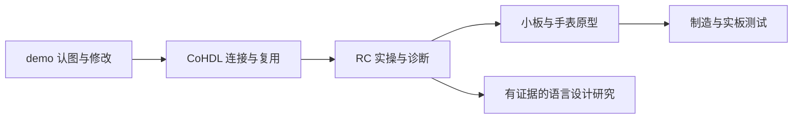

# 用一块板，把知识连起来

**当前学习案例：** [Sonde 电路完整解读](course/01-sonde-circuit.md) · **[CoHDL 源码与实际检查/编译结果](cohdl/sonde-case.md)**。

**新增可运行课程：** [十路 RC：连接、单件布局覆盖与扩成十二路](course/03-rc-workflow.md) · [读懂编译器诊断](cohdl/diagnostics.md)。基于当前 main `0e3d770`，完整实验已由代理验证；你的学习状态见[进度表](learning/progress.md)。

这本书从现成 KiCad demo 开始。你会先认出一个元件、一条网络和一段铜走线，再亲自修改、检查和修复。随后用 CoHDL 做第一块小板，逐步走向带屏幕、蓝牙、运动传感和电池充电的手表主板。

第一个手表版本保留调试空间。等显示、通信、传感器、电源和固件配合工作，再根据屏幕、电池和外壳缩板。每次学习留下的解释、失败案例和实测结果，都会成为这本书的新内容。

## 先从哪里读

**第一次接触 PCB：** [工作台](course/00-workbench.md) → [看懂连接](course/01-read-board.md) → [修改与检查](course/02-edit-check.md) → [功能区与复用](course/03-functions.md) → [第一块小板](course/04-first-board.md)。中间遇到术语，查 [术语表](appendix/glossary.md)。

**想边用边参与 CoHDL 开发：** [连接模型](cohdl/connections.md) → [subdesign](cohdl/subdesign.md) → [十路 RC 实操](course/03-rc-workflow.md) → [诊断与源码入口](cohdl/diagnostics.md) → [构建到 PCB](cohdl/pipeline.md)。用能复现的问题进入源码和测试，再判断是否需要改语言。

完整依赖关系和每课产物见 [学习路线](route.md)。当前实际学习状态见 [进度表](learning/progress.md)。

这张图表示学习顺序。构建成功不保证后续制造或功能测试成功；电流回路、滤波、供电和布线还需要对应的解释、计算与物理证据。

## 语言研究按需阅读

“CoHDL 当前能力”用于学习已经实现的语言；目录中的“语言设计研究”另收[设计原则](cohdl/language-principles.md)、[产品边界](cohdl/product-boundary.md)、[tscircuit 对照](cohdl/tscircuit-reference.md)和 M2 材料。

M2 先读[当前中文导读](cohdl/programming-proposal.md)，需要完整条款再读[中文 RFC 全文](cohdl/programming-rfc-zh.md)或[英文工作稿](cohdl/programming-rfc-en.md)。两版于 2026-09-12 对齐，用户已选 A、B 延后，仍是 Proposed；发生表述歧义时以英文为准。

## 每次只解决一个可观察的问题

一课按这个顺序进行：

1. AI 用当前工程里的位号、pin 和 net 解释一个问题。
2. 你预测修改后会发生什么。
3. 你或 Konnect 执行一次有边界的操作。
4. 看图、读工具数据、运行适用的检查。
5. 你用自己的话复述，再把结果写进 [学习记录](learning/template.md)。

例如，先讨论“移动 R1 后，焊盘还是同一个网络，为什么可能出现未连接项”，再实际移动它。这样能把逻辑连接、物理走线和检查结果联系起来。

## 工具各自做什么

| 工具 | 在本课程中的职责 |
| --- | --- |
| GPT-6 / Codex | 阅读工程、解释、提出修改、调用工具，协助整理学习记录 |
| Konnect | 把查询和编辑操作连接到 KiCad；部分导出/检查调用 KiCad CLI |
| KiCad | 查看和编辑原理图、封装及实际 PCB，配置物理规则、布线和检查 |
| CoHDL | 描述电路，检查已建模条件，生成网络、BOM 和 PCB 起点 |
| CoHDL Explorer | 查看检查后的逻辑设计；分组不改变电路拓扑 |
| 固件与仪器 | 验证收到的板子是否按设计工作，并记录测量条件 |

Konnect 不在内部选择 GPT-6；模型由客户端选择。工具调用成功只说明那个操作完成，检查结论仍取决于检查对象和范围。

## 阅读标记

- **教程初版**：有操作步骤；实操验证状态另列。
- **任务说明 / 课程提纲**：目标和验收已安排，具体电路随学习确定；目录标记描述教材体裁，学习者完成情况另记。
- **当前能力**：在资料页所列代码基线中存在；是否执行过该例子看记录。
- **未来能力**：语言提案或待研发目标，不能复制后当成当前语法运行。
- **同步译本**：与注明日期的英文版本逐节对应；同步不表示提案被接受或功能已实现。历史材料按记录日期阅读。
- **未验证**：缺少适用证据，保持未验证状态。

书中的网络图说明逻辑关系；PCB 层图说明铜和几何。制造、射频、热和续航结论还需要对应工艺资料与测量。

## 这本书如何长大

每课产生一条具体学习记录。适合重复查阅的解释进入 CoHDL 知识章节，具体操作留在课程，原始结果保留在记录中。相同知识集中解释一次，其他章节通过链接引用。

记录按[工作台与电路实操](learning/workbench-circuits.md)、[语言设计与 RFC](learning/language-rfc.md)、[教材维护与验证](learning/book-maintenance.md)三个主题查阅。侧栏点主题名称打开索引，点旁边箭头展开历史记录；当前进度和记录模板可直接进入。

版本基线和外部资料集中在 [资料与版本](appendix/sources.md)。语言规范以仓库 Accepted RFC 和已记录的偏离为准；本书不会把教学设想变成语言规范。
