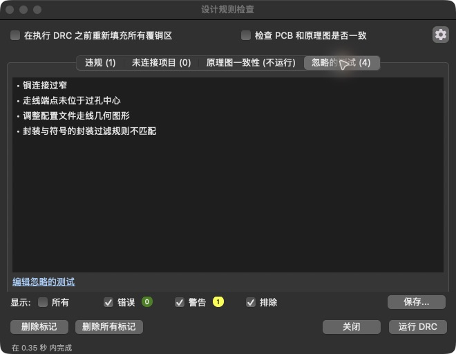

# 2026-09-07：铜连接与检查基线

对应章节：[第 1 课](../course/01-read-board.md)、[第 2 课](../course/02-edit-check.md)。状态：R1 铜路径与检查基线已核对；移动/修复实验、用户复述和实物测试未执行。

## 保存与输入身份

用户要求继续操作。沿用 Konnect 0.11.0、KiCad CLI 10.0.6 和已接通的临时标准 MCP 会话。`check_kicad_ui` 返回 GUI/IPC 均正常；`open_project` 确认唯一打开的 PCB 是练习副本：

```text
/Users/zhangalex/Work/CoHDL/watch-lab/lessons/01-sonde/sonde xilinx.kicad_pcb
```

保存前把完整练习目录归档到 `/tmp/cohdl-sonde-before-first-save.tar.gz`，并记录设计文件 SHA-256。随后通过 Konnect `save_project` 保存当前板；GUI 标题的星号消失。KiCad 同时更新了 `.kicad_pcb` 与 `.kicad_pro`，原理图 `.kicad_sch` 哈希不变。旧格式升级由 KiCad 完成，没有用文本工具改设计文件，也未执行器件移动或走线修改。

本次检查对应的文件哈希和覆盖范围见 [检查元数据](evidence/2026-09-07-sonde-check-coverage.json)。临时备份是本机恢复点，不是书籍随附文件。

## R1 两侧的铜路径


`query_traces` 返回的原始顺序不是电气路径顺序。以下按相接端点排序，坐标单位为 mm；两条网都包含 3 段底层 `B.Cu` 走线，宽度均为 0.635 mm。

| 网络 | 从 R1 出发的走线中心线坐标 |
| --- | --- |
| `Net-(D1-K)` | R1 pad 1 `(121.92, 73.8632)` → `(121.92, 73.025)` → `(122.555, 72.39)` → D1 pad 2 `(127.0, 72.39)` |
| `/VCC_SENSE-ERROR*` | R1 pad 2 `(111.76, 73.8632)` → `(109.4232, 76.2)` → `(106.045, 76.2)` → `(105.537, 76.581)`，接到 J1 pad 15 |

根据返回的直线坐标计算，中心线长度分别约为 6.1812 mm 和 7.3179 mm。这是走线段长度求和，不是信号延迟或电阻计算。

J1 pad 15 的中心为 `(105.5116, 76.6382)`，与走线末端相差约 0.0626 mm；它位于底层，与走线层一致。连接并不要求端点精确落在焊盘中心：铜有宽度、焊盘有面积。结合连续走线、焊盘同网同层和当前 DRC 的 0 未连接项，本课有证据支持两条 R1 路径在 CAD 中连通；没有做实板通断测量。

原始 MCP 返回，包括 UUID、宽度和焊盘集合，见 [走线证据](evidence/2026-09-07-sonde-traces.json)。

## 再追一个 IC 电源端

U1 pad 14 位于 `(134.62, 82.55)`，属于 `VCC`；C1 pad 1 位于 `(134.62, 76.2)`，D1 pad 1 位于 `(134.62, 72.39)`，同属 `VCC`。查询得到的两段底层走线依次连接这三个坐标，宽度均为 1.016 mm。

这说明一个 net 可以连接多个器件端点。它不证明 VCC 的实际电压、电流能力、噪声或 C1 的去耦效果；这些仍需要电路工作条件和适用的测量。

## 检查结果与未覆盖内容

Konnect 先执行原理图短接检查，再执行 ERC 和 DRC，均使用已存在的练习文件；DRC 显示结果没有被条数上限截断。

| 检查 | 结果 | 解释 |
| --- | --- | --- |
| `find_shorted_nets` | 0 个候选短接 | 该原理图分析器未发现不同命名网络共用导线路径；不等于完成所有电路审查 |
| `run_erc`，severity `info` | 0 错误、2 警告 | J1/J2 的旧库封装引用未找到 |
| `run_drc`，severity `info`，limit 500 | 0 错误、1 警告；未连接项 0；未截断 | 警告为 J2 的板上封装与本地库副本不匹配 |
| GUI DRC，显示包含排除项 | 同样为 0 错误、1 警告、未连接项 0 | 此次关闭重新填充选项以保留现有覆铜，执行后恢复原选项；不进行几何修改 |
| 单项排除列表 | 空 | 保存的项目元数据 `drc_exclusions: []` |
| 忽略的测试 | 4 项，见下表 | 某类测试被忽略与某条违规被排除是不同机制 |
| 原理图一致性 | **未运行** | GUI 显示“不运行”；不得把工具返回的 `schematic_parity: 0` 当作验证完成 |

### 四项忽略测试

| GUI 名称 | 保存的规则键 |
| --- | --- |
| 铜连接过窄 | `connection_width` |
| 走线端点未位于过孔中心 | `track_not_centered_on_via` |
| 调整配置文件走线几何图形 | `tuning_profile_track_geometries` |
| 封装与符号的封装过滤规则不匹配 | `footprint_filters_mismatch` |



GUI 运行前的忽略测试页曾为空，执行检查后才显示上述 4 项；不能把未运行时的空面板记成“没有忽略测试”。`get_design_rules` 只返回部分尺寸约束，未包含忽略/排除字段，因此在 GUI 核对后只读检查保存的 `.kicad_pro` 中这两类元数据。

Konnect 0.11.0 的 `crates/konnect-core/src/tools/cli.rs` 调用 `kicad-cli pcb drc` 时没有请求原理图一致性检查，也没有请求返回排除项。报告有一个空分类，与该测试确实执行过是两回事。本次不据此宣称整板审查完整或可以投产。

### 三条库警告

| 来源 | 对象与规则 | 当前事实与后续处理 |
| --- | --- | --- |
| ERC | J1，`footprint_link_issues` | `Connector_Dsub:DSUB-25_Male_EdgeMount_P2.77mm` 未找到；先核对本地 `sonde-xilinx` 封装，再决定是否用 `edit_schematic_component` 修正原理图的封装引用 |
| ERC | J2，`footprint_link_issues` | `Connector_Dsub:DSUB-9_Male_EdgeMount_P2.77mm` 未找到；同样需要核对正确引用 |
| DRC | J2，`lib_footprint_mismatch` | PCB 中已放置的 J2 与 `sonde-xilinx` 库内同名封装不同；先使用 KiCad 的封装与库比较确认具体差异，再决定更新方向，随后重跑 DRC |

这是第 2 课的基线，不是本次新增的断线。警告尚未修复或豁免。完整结果见 [MCP 检查证据](evidence/2026-09-07-sonde-checks.json)、[DRC 报告](evidence/2026-09-07-sonde-drc.json)、[ERC 报告](evidence/2026-09-07-sonde-erc.json)。报告是 Konnect 导出的结构化结果，不能假定保留了 KiCad 原生报告的全部字段；本次未用 ERC wrapper 返回的坐标导航。

## 本次 CoHDL 学习点

CoHDL 的 `net` 表达端点连接要求；PCB 工具读取的铜路径回答该要求是否在板上实现。本次没有改变 net 或编写 demo 的 CoHDL 重建源码，却已经能观察逻辑连接、实体焊盘、铜路径与检查范围之间的区别。

这也为未来 M4 的契约结果解释提供实际案例：未建模、未运行、被忽略和已检查无问题必须区分。本次只补充教材解释，没有据此宣布新的语法或编译器功能已经实现。

接下来可以进入第 2 课的移动与恢复实验；开始前先让用户复述“同网”和“铜接通”分别依赖什么证据。本次没有收到该复述，学习进度不标为完全掌握。
