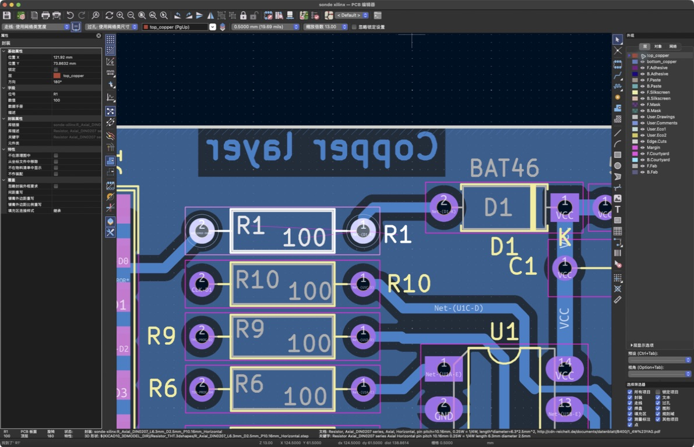

# 2026-09-08：从 R1 重新开始

对应章节：[第 1 课](../course/01-read-board.md)。状态：重新讲解中，已收到能看到的反馈，继续辨认位号。

用户明确反馈：“本课要学什么，我没看懂”，要求重新操作。先前完成的工具查询、路径分析、DRC/ERC 和教材更新仍是技术事实，不能据此判断用户已经认出焊盘或理解网络。

本次把目标缩小到画面中的三个对象：R1 的安装位置、它的两个焊盘、通向另一个器件的铜走线。采用一个对象一个停点的方式：先示范、保持画面、请用户指出看到的对象，再继续下一步。网络术语、CoHDL 映射和检查报告放在直观认识之后。

## 已重演的第一步

使用桌面操作工具读取当前 `sonde xilinx — PCB 编辑器` 窗口。打开查找框，把搜索词设为 `R1`，保留全字匹配，执行查找，关闭对话框，再在缩放下拉菜单选取 13.00。截图确认 R1 的安装图形、值 `100` 和两个焊盘编号已清楚可见；没有修改器件位置或铜走线。

向用户解释：R1 是电阻编号，100 是 100 ohm；左右带孔圆环是焊盘，实物直插电阻的两根脚分别焊在这里；当前画面左边编号 2，右边编号 1。

随后询问用户是否能认出这两个焊盘。用户回答：“能看到，但是下面还有个r1？”这确认了画面可见，但还不能据此记录为掌握。

## R1 下面为什么看起来还有 R1

实际截图显示，下面的器件是 R10；框内编号的末尾 0 被红色顶层铜走线遮挡，右侧仍能看到完整的黄色 R10。通过右侧层面板点击 `top_copper` 的可见性图标，暂时隐藏顶层铜显示后，框内的 R10 也完整露出。该操作只改变显示，没有删改铜走线。

可复用的解释：器件编号可能在不同图层上重复显示；同一个安装位置旁的多个相同编号，不表示存在多个器件。先辨认完整位号，再看它对应的两枚焊盘。

## 已展示 R1 到 D1 的铜连接

用户随后要求继续。保持相同视角与缩放，在右侧外观面板选择“网络”页签，右键 `Net-(D1-K)`，执行“高亮 Net-(D1-K)”。实际截图确认 R1 右焊盘 1、D1 左焊盘 2 及中间的底层铜走线亮起，其他网络变暗。

向用户说明：从 R1 右边标 1 的焊盘向上，沿拐弯后向右的浅蓝色铜线，到达 D1 左边标 2 的焊盘。做成实物后，这段铜像板上的导线，把两个器件各自的一只脚接起来。这里的跟随顺序是看图顺序，不是电流方向；路径位于 `B.Cu`，与此前 Konnect 查询的结果相符。

询问用户能否沿亮线找出两个端点后，用户回答：“能看清，继续。”这提供了第一条高亮连接可见的反馈；尚未要求用户独立重做操作或复述连接概念。

## 已展示 J1 到 R1 的另一条连接

缩放到 8.00，把连接器 J1 纳入画面，清除连接器整组选中的效果，再在网络列表右键 `/VCC_SENSE-ERROR*` 并执行高亮。随后在“层”页签选中 `bottom_copper`，使底层的连接器焊盘编号显示在前面。最终截图的视角已放大到 16.09；这一进一步缩放不是代理选择的 8.00，不把它记为代理执行的操作。

截图清楚显示：J1 的长方形焊盘 15 经浅蓝色铜线连接到 R1 的圆形焊盘 2。结合前一步，R1 左端连 J1，右端连 D1，两端之间安装 100 ohm 电阻。向用户补充：焊盘可以有不同形状。本次只切换显示与高亮，没有修改铜几何或器件位置。

已请用户用自己的话回答“器件的脚焊在哪里，两个器件的焊接点之间靠什么连接”。这项复述尚待反馈，不把两张高亮截图记为完成学习验收。

## 回到焊盘的实物含义

用户继续问“什么是焊盘”。这表明此前“能看清”的反馈不能等同于已经理解焊盘概念，当前先解释实物安装，再继续连接术语。

补充解释：焊盘是板上专门用来焊接元件引脚的一小块金属，元件尚未安装时它就已经存在。以 R1 为例，孔用于穿过电阻脚，孔周围的金属圆环用于焊接；焊锡把引脚与焊盘固定并导通，焊盘再连着铜走线。同时说明贴片焊盘可以没有孔，避免把焊盘等同于通孔。本次只是概念讲解，没有实际焊接或硬件测量。

## 补充整板用途

用户询问“当前这个电路图作用是啥”。本次先返回整体用途，核对已有 XML 导出网表的标题 `PARALLEL CABLE III`、25 个器件及网络连接，并计算原 demo 与练习副本的原理图 SHA-256；两者都与先前保存的原理图基线一致。导出发生在父目录改名前，没有把旧导出当作新的 IPC 读取。提取结果及来源信息保存在 [用途核对数据](evidence/2026-09-08-sonde-function.json)。

解释：这是一块连接电脑并口与 Xilinx FPGA 目标板的下载器接口板。J1 是电脑侧连接器，U1/U2 是数字缓冲器，J2/P1 是目标板侧连接器；配置和状态信号经过这些接口传递。用途依据包括 [Xilinx ChipScope Pro 用户指南第 42 页](https://docs.amd.com/api/khub/documents/jTy2Pwg8odiavQf4ellMvQ/content#page=42) 与本地网表。

对 R1/D1 支路的解释明确标为推断：VCC 经 D1、R1 接到 J1.15 的 `/VCC_SENSE-ERROR*`，结合拓扑与标签判断其供电存在检测用途。没有测量它的实际输出电压或验证电脑识别行为。

核对还发现本地 U1/U2 标注为 `74LS125`，不能把网上同类电路的 `74HC125` 参数直接套入。用于理解功能的 [TI SN74LS125A 资料](https://www.ti.com/product/SN74LS125A) 给出推荐供电 4.75–5.25 V；本地输入网名虽然写着 `/PWR_3,3-5V`，这个标签本身不能证明所标 LS 器件支持整个范围。这里只保留后续器件核对事项，不作通电验收结论。

教材开头已补“电脑 ↔ 接口板 ↔ 目标板”的用途说明。后续教学先交代整板服务的对象，再追单条连接；用户对整板用途的理解尚待反馈。

## 解释原理图符号

用户询问“原理图符号是啥”。用 R1 的简化长方框及两端引脚示意解释：符号在原理图里代表元件，用于表达引脚与电气连接；实物电阻是实际安装的元件，PCB 封装则表达焊盘和安装几何。明确这个教学示意不是 GUI 截图，也没有把符号图形当作元件的实际尺寸。本轮没有切换或修改 KiCad 工程，用户对符号与封装关系的理解待反馈。

## 学习者开始对应 PCB 与实物

用户复述：“所以pcb图 r1中间空白处是要焊接一个电阻器”。这提供了初步理解证据：用户已将 PCB 上 R1 的安装区域对应到一只实物电阻。进一步说明电阻本体位于中间，两根脚插入左右孔中，并焊到孔周围的金属焊盘上。只记录这项具体对应，不据此推定用户已掌握网络、布线或整个第 1 课。

## 补充 PCB 简史

用户要求简单介绍 PCB 的发展历史。围绕手工接线、板上形成导电图形、通孔插装、贴片装配和提高连接密度展开，并把 R1 的通孔焊盘与未来手表上的贴片焊盘联系起来。参考原始专利、历史行业资料、博物馆资料与制造商工艺说明，整理为 [PCB 简史](../appendix/pcb-history.md)。这项背景讲解不改变课程实操状态，也不预先确定手表的层数或 HDI 工艺。

## 待继续

先帮助用户对应同一只 R1 的实物、原理图符号和 PCB 焊盘，确认理解后再引入 net 与实际铜连接的区别，并对照 CoHDL 的连接描述。

本次没有重跑 DRC/ERC，没有新硬件结论，没有改动或新增 CoHDL 语言能力。
