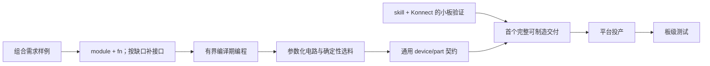

# CoHDL roadmap：语言组合、可编程设计与 PCB 交付

日期：2026-09-07。状态：**讨论稿；不是 Accepted RFC，也不是实施授权或发布承诺。**

> 2026-09-08 进展：main `ab44257` 已通过 PR #35/#36 实现并修复 RFC-032 subdesign，支持端口、具名层级、嵌套/数组、泛型和整体布局及单件覆盖。[Book 实验](../../book/src/cohdl/subdesign.md)已验证两路 RC。下面“依据与现状”和备选方案保留 2026-09-07 的历史讨论；其中 subdesign 尚待提案的状态已被本更新取代。M2–M4 的缺口仍需分别验证。正式 RFC-032 指 subdesign，非本地旧 harness 候选提案。

> M2 后续：已按用户要求起草[有限编译期可编程能力 RFC](../proposals/rfc-draft-bounded-compile-time-programming.md)，以整体一致性评审为主线，状态 Proposed，编号未分配。其未来验收项不代表编译器已经支持循环。

本路线依据本轮产品 review，按三个产品阶段组织：①完成可投产的 PCB 设计；②帮助客户在 JLCPCB、PCBWay 等平台完成投产；③帮助客户测试收到的板子。近期研发优先级保持为：子设计/复用 → 可编程能力 → 参数化模块选料 → device/part 契约检查。

建议：以语言补齐为主线，以 skill + 现有工具支撑真实板验证。保留旧 harness RFC 的证据意识，把完整 orchestration、形式化证明和平台交易框架放到实板流程暴露具体需要之后。

配套学习路线见 [从 Konnect demo 到手表主板](2026-09-07-watch-learning-and-language-milestones.md)：用户已选定屏幕、蓝牙、运动传感、电池充电的可调试原型。手表提供语言能力的实际使用场景；本文的四功能区、LED 链和十路 DC/DC 仍作为独立语言验收样例。

## 依据与现状

分析基线是本分支 `docs/proof-gated-agent-harness-rfc`，CoHDL 0.6.0，提交 `9ac0e3c`。本次核对源码、现有测试定义、PR 正文/讨论/差异和本地 Konnect；未构建新语言原型或验证实际布线成功。

- [PR #32](https://github.com/conol-ai/cohdl/pull/32) 已关闭；[旧 harness 提案](../proposals/rfc-032-proof-gated-agent-harness.md) 留作设计参考，其本地 `Proposed` 文字不代表已经接受或仍在排期。
- [PR #33](https://github.com/conol-ai/cohdl/pull/33) 仍未合入，最新讨论要求先验证现有 `module + fn`，再证明 `fn` 输出或 `subdesign` 的必要性。差异中的实现是 `#[virtual] inst` 原型，并没有实现文档中讨论的 `subdesign`。
- 两份提案都使用过候选编号 RFC-032。路线图只用工作项名称；正式编号应在设计源仓库确认，不能把两份提案视作同一个 RFC。
- 本地 Konnect 基线是 `/Users/zhangalex/Work/CoHDL/Konnect`，v0.11.0，提交 `1f96aad`。KiCad CLI 已实测为 10.0.6；本次没有建立 Konnect 实时连接。工具能力以该版本源码为依据，不把 beta 文档的功能表当成实板验收。

| 用户需求 | 当前基础 | 尚缺什么 |
| --- | --- | --- |
| 电源、MCU、电机、传感器分开组织 | RFC-016 文件模块、`use`、包可见性；Explorer 分组 | 确认现有接口能否保持模块独立；必要时补输出接口或保留的类型化层次 |
| 一个 DC/DC 电路复用十次 | RFC-006 嵌套 `fn`、RFC-007 泛型；每次调用产生独立真实元件 | 少写重复调用需要循环；调用没有返回值，也没有源代码可引用的调用结果对象 |
| LED 数组相邻串联 | RFC-024 `inst leds: [Device; N]`，当前 N 和索引为字面量 | 常量参数、整数表达式、循环、计算索引、数组长度查询 |
| 输入 12V、输出 5V、500mA 的参数化模块 | 带单位规格、具体 part、库依赖锁定、registry 搜索 | 电路配方、参数计算、候选筛选、计算与选型记录 |
| pin 电压/电流等断言 | 单位系统、pin obligation、四条 residual DRC；D001 使用网电压标注与器件 `voltage_rating` | pin 级条件与限制、part 级细化、事实来源和无法判定时的处理 |
| 完成可制造板 | 原生 `.kicad_pcb`、BOM、布局/物理提示、IPC-2581 | 实际放置布线、工艺规则、最终板与逻辑一致性验证、制造导出 |

源码锚点：[FnDef/Stmt](../../src/ast.rs)、[展开与 Binding](../../src/check/expand.rs)、[现有复用电路](../../lib/passive/src/circuits.cohdl)、[精确选料](../../src/emit/mod.rs)、[四条 DRC](../../src/drc.rs)、[PCB emitter 合同](../kicad_pcb.md)、[Explorer](../../explorer/README.md)。

## 三个产品阶段

| 阶段 | 用户获得的结果 | 验收边界 |
| --- | --- | --- |
| 1：设计可投产 | 有明确适用范围的完整 PCB、精确 BOM、制造文件与检查记录 | 实际最终板布通、规则满足、元件/网络与 CoHDL 一致；裸板与贴装就绪分别记录 |
| 2：完成平台投产 | 工厂适配文件、选料与贴装预览、报价/订单/工程问题闭环 | 平台实际接受的订单及其文件版本可追溯；文件上传成功不是订单已接受 |
| 3：板级测试 | 上电/接口/负载测试步骤、仪器或人工实测值、问题定位 | 实板结果绑定板版本、序列号、固件、测试条件；静态检查结果不代替测量 |

阶段 1 的首个交付可以先完成裸板制造资格，但必须标明贴装状态，不能据此宣称 PCBA-ready。涉及贴装的工艺可行性在阶段 1 检查，平台专用 BOM/CPL 转换、库存确认和订单操作在阶段 2 完成。

## 阶段 1 的主线



M1–M4 是语言研发顺序。K1 是可以用现有语言开始的配套验证工作，不以等待全部语言特性为前提，也不先建设大型 harness。M3 自身必要的输入检查与配方边界必须随配方交付，不能等 M4 才拒绝不支持的输入。

### M1：用真实需求确定组合边界

把需求拆开验收：

1. **关注分离**：电源、MCU、电机、传感器各自维护实现，由顶层组合；展示分组由 Explorer 承担。
2. **电路复用**：DC/DC 定义一次，调用十次，产生十套实际电路。此时允许十条调用语句；M2 再消除调用重复。

三个候选的取舍：

| 方案 | 适合解决的需求 | 代价与选择条件 |
| --- | --- | --- |
| 现有 `module + fn` | 文件组织、显式 pin/instance 参数、嵌套复用 | 首选验证路径，零新概念；不能把已结束调用的内部 pin 作为返回值拿到 |
| 为 `fn` 增加有限输出接口/命名调用能力 | 同级片段独立构造后连接输出；为调用建立明确身份 | 仅在实验暴露该缺口时提出 RFC；必须定义输出类型、作用域、身份和诊断 |
| 一等 `subdesign` | 必须保留可寻址、有类型、受封装保护的层次对象 | 要完整定义端口、包含、递归拒绝、可见性、泛型、IR、Explorer 和制造投影；不能只凭“想分组”引入 |

`module` 继续只管源文件与命名空间，导入不能产生元件。`fn` 继续负责可复用电路展开。`subdesign` 只有在保留的层次本身成为语言语义时才成立。界面的页签/区域可以投影这些结构，但页码不参与连通性。

**实验应证明接口质量，不能只证明某种改写勉强编译。** 例如，把 `controller()` 塞进电源库虽然可能解决返回值问题，却让通用电源库依赖客户 MCU，这不满足关注分离。允许顶层编排函数持有真实边界元件并传 pin；不允许为绕过接口不足凭空增加器件、BOM 行或虚拟物理实例。

验收：

- 四个功能区能独立定义，由顶层显式组合；通用电源定义不依赖具体 MCU/电机模块。
- DC/DC 定义只有一份；十次调用得到十套相互独立的元件和输出网，公共输入/地只在显式连接处共享。
- 同名内部实例不冲突；每个真实元件照常经过 pin、part、designator、BOM 与 emitter 检查。
- 与手工展开版本比较元件、规格、pin-to-net 分区的一致性；名称差异要显式归一化，不伪装成逐字节相等。
- 缺 pin、错单位、递归调用、内部引用越界都有指向具体调用/定义的诊断；Explorer 能显示来源分组。
- 对“同级片段事后连接输出”和“稳定引用第 7 路”分别给出可运行示例或精确失败点，再决定是否补语言。

身份必须单列决策：现有 fn 路径使用全设计 `__fn{counter}`，保证相同源码确定，不保证插入一条调用后其他路径不变。如果新特性需要命名调用或模块对象，应定义稳定源身份，并规定 design.lock 的迁移；既有语法的历史输出不借机改名。

涉及：[ast.rs](../../src/ast.rs)、[resolve.rs](../../src/resolve.rs)、[check/expand.rs](../../src/check/expand.rs)、[ir.rs](../../src/ir.rs)、[lock.rs](../../src/lock.rs)、[Explorer model](../../explorer/extractor/src/model.rs)。新语法同时覆盖 parser、fmt、LSP、文档与测试；仅组织现有 fn 的实验不需要这些改动。

### M2：有限、确定的编译期编程

目标是生成电路结构，首批支持整数常量/常量参数、数组长度、算术索引、静态范围 `for`、命名与作用域；再按配方需要加入纯表达式与条件分支。不引入运行时线程、任意递归、文件/网络访问或隐式脚本执行。

下面是**目标语义示例，当前编译器不支持 `for`、`.len` 或计算索引；不是已接受语法**：

```text
inst leds: [LED_XXOO; 10]
for n in 0..(leds.len - 1) {
    net _: leds[n].DO, leds[n + 1].DI
}
```

这里沿用当前数组声明形状；半开区间生成 n=0…8，共九条相邻连接。实际 LED 的引脚名与首尾义务取器件定义，示例只表示链路中段。

应一次设计清楚：

- N 可否是显式整数常量参数；整数与物理单位分离，不把裸数字自动转换为 Voltage/Length。
- 循环体中的实例、局部网、嵌套 fn 调用和 `place` 使用同一套展开/命名规则；外层引用不能依赖拼接隐藏名字。
- 保留现有声明式引用规则，不因循环引入意外的执行顺序依赖。
- 范围、下标、溢出、除零与展开数量全部检查；范围必须编译期可确定，超过明确且版本化的展开上限时报错，不截断。
- 新展开项携带定义位置、调用位置与迭代索引；报错应指出 `leds[7].DI` 或第七路调用。
- 单位算术按后续配方真实需要扩展：同量纲加减/比较、无量纲比例与标量运算先行；跨量纲运算须明确规则。中间数值、舍入和溢出策略固定，不能依赖平台浮点行为。

验收：10 颗 LED 的九条链路无遗漏；1 颗时循环零次；零长度数组、越界、负下标、除零和过量展开得到明确结果；十次 DC/DC 调用由循环生成；循环生成的 `nc`/fn 参数/`place` 与手写形式一致。既有 RFC-024 fan-out 行为与旧源码字节输出保持不变。

涉及：lexer/parser/AST、[units.rs](../../src/units.rs)、泛型与展开、fmt/LSP，以及 [数组测试](../../tests/inst_array.rs)。推荐表达式求值只有一个实现，由常量、索引、配方计算和后续契约共同消费。

### M3：从规格到参数化电路与可解释选料

首个垂直样例固定为 **12V 输入、5V 输出、500mA 负载的非隔离 DC/DC**。第一步由板作者/配方定义输入范围、输出容差、环境与纹波要求等必要条件；不能从这三个数字推断全部要求。

按三个增量交付：

1. **固定器件的配方**：固定一个经资料核对的转换器和适用输入范围，参数化输出/负载，计算并选择反馈电阻、电感及电容；配方包含来源、假设、适用域和失败条件。
2. **有限目录内选择**：从锁定版本的已审核器件与无源件集合筛选候选，按显式策略排序；无候选即报错。器件工作范围、容差、额定值降额和实际可购买的离散值参与选择。
3. **扩展配方族**：验证过的配方再成为库 API，逐步加入另一款 buck、LDO、LED 驱动等；每增加一族都有独立适用范围和失败样例。

分工：AI 搜索资料、提出拓扑和候选并解释取舍；库保存经审查的公式/选型规则；确定性求值器在固定输入与目录上计算；编译器核对单位、结构、绑定与适用的契约。价格和库存可供采购决策，但不能让同一 source + lock 的离线 `check/build` 随当天库存换料。

当前 [bind_parts](../../src/emit/mod.rs) 按 device、variant、具体规格精确匹配，多个候选按名字确定性选择；这不等于工程选型优化。新增选择策略应独立规范，不能偷偷改变该已有行为。首版可以把选料结果固化为显式 part 和现有包锁；若要保留配方/目录快照，则明确它们如何成为输入身份，不先创造一个重复的通用锁系统。

验收：

- 相同规格、配方版本、候选集合与策略得到相同 part/数值及说明；结果可通过现有 build 输出真实 BOM。
- 改变输出电压，反馈网络随计算改变；改变负载，相关额定值重新核对；超出适用范围或无料明确失败。
- 记录公式、输入、理想值、选中的标准值、容差核算、datasheet 来源和未验证事项；只验证有模型支持的性质。
- 十路展开的每一路都经过相同验证；若十路可同时带载，顶层需显式计算总功率与输入预算，不能用单路 500mA 当系统总负载。效率等假设必须给出，不能默认 100%。

所需库数据与 helper 放在领域包，不进入仅含核心 traits 的 `std`。已有生成器所管理的零件数据仍通过生成器维护。适用入口：[generics.rs](../../src/check/generics.rs)、[units.rs](../../src/units.rs)、[emit/mod.rs](../../src/emit/mod.rs)、领域库和 [API docs](../apidocs.md)。

### M4：可执行的 device/part 契约

目标是把器件作者的限制变成用户设计中可检查的断言。先定义事实与检查时机，再决定 `assert` 的写法；不能仅在 device 上存一个字符串而声称已检查。

| 约束类型 | 必须有什么事实 | 合适的检查位置 |
| --- | --- | --- |
| 参数/规格合法性 | 实例化参数、单位、允许区间 | 类型/实例化检查 |
| 具体 part 的限制 | 已解析 part 与其规格/条件 | 显式 part 可提前检查；build 自动绑定后的限制必须在绑定后检查、发射前失败 |
| pin 电压限制 | 参考节点、网电压或范围、器件该 pin 的工作条件 | 连通后检查；不能仅拿器件统一 `voltage_rating` 代替所有 pin 的限制 |
| pin/模块电流预算 | 支路负载需求、方向、工作模式、器件额定值 | 具有明确定义的预算模型时检查；一个网的 `high_current` 提示不是每个 pin 的实测电流 |
| 纹波、瞬态、温升等行为 | 适用模型与边界条件，或实测证据 | 配方分析/外部仿真/阶段 3 测试 |

具体设计要求：

- 区分推荐工作范围和 absolute maximum；记录限制适用的温度/电源/模式条件。
- device 提供通用契约；part 可以表达具体型号条件，不能无依据放宽所继承的限制。
- `pass`、`fail`、`unknown/not checked` 分开记录。必需检查缺少输入时不能算 pass；旧库未声明新契约也不自动获得“全部电气安全”的结论。
- 函数、循环、未来组合对象中的断言都能定位到具体实例、pin、实际值、阈值与数据来源。
- 兼容性按显式新声明逐步引入；不能使所有旧包因缺新字段突然失败，也不能宣称旧包已有相同覆盖。

**RFC 边界需要正面处理。** RFC-004 当前锁定四条 residual DRC。局部结构/规格条件应进入类型检查；真正新增的网络级电气规则必须在新 RFC 中明确与 RFC-004、D001 的关系、执行顺序和诊断迁移。另建文件不等于绕过该规范边界，也不复活 legacy 的通用 rule 引擎。

验收应包含边界值通过、超限失败、错误单位、缺事实、条件不适用、part 细化与继承冲突、十路调用中仅一路失败、build 后绑定才可判定，以及依赖包中契约的诊断定位。

## K1：用 skill + Konnect 尽早跑通 PCB

这条工作线服务阶段 1 的真实验收。先复用工具和少量脚本；新固定 schema/自动恢复器只有出现跨运行维护成本时才单独立项。

职责划分：

- `.cohdl`、精确依赖和 `design.lock` 是逻辑/器件身份来源；Explorer 负责读图与分组。
- `cohdl build --emit kicad_pcb` 输出起始板；复制到独立 `pcb/` 工作目录后由 Konnect 操作。编译器拥有的 `out/` 不能承载持久布线。
- Konnect 操作最终板的布局、布线、铜皮和制造设置；KiCad CLI 检查/导出保存后的实际最终板。
- 元件或连接关系需要改变时回到 CoHDL 修正；不在 KiCad 中形成无人维护的第二份逻辑设计。早期源变更后重新生成候选，再应用显式布局；不承诺已经存在无损的双向 ECO。

| Konnect 能力 | 在 CoHDL 中的用法 | 接入时要验证的边界 |
| --- | --- | --- |
| `get_board_info`、`get_component_list`、pad/net 查询 | 导入后的身份和连通性检查 | 对比所有实际 pad，包含多 pad pin、机械件、底面与任意角度 |
| 放置/旋转/批量 placement、布局评分 | 人工或 AI 辅助放置 | 评分只是反馈；验证板框、courtyard、锁定位置和真实距离 |
| track/via、铜皮操作 | 局部布线与修复 | 拒绝不支持的几何，不把调用成功作为“全部布通” |
| DSN → Freerouting → SES | 符合支持范围的自动布线尝试 | 引擎另行安装；校验修订绑定、几何/现有走线限制；不支持时可人工布线 |
| DRC、制造预检查、Gerber/drill/position 导出 | 最终物理检查与文件输出 | 固定实际版本和工艺配置，检查导出文件确实存在并属于被检查的板 |
| JLCPCB 搜索与资料查询 | 候选发现、后续采购参考 | 替代推荐不能跳过电气/封装核对；缓存库存不是当前报价 |

**不能原样套用整个 Konnect 原理图工作流。** CoHDL 当前没有原生 `.kicad_sch` 输出；Konnect 的 `update_pcb_from_schematic` 和 schematic ERC 不适用于这条主线。Konnect 制造包的 BOM 分支也要求 schematic，无该参数会明确不生成 BOM。应复用 PCB 导出能力，保留 CoHDL BOM；不能另造一份手工 KiCad schematic 只为喂满工具参数。

首个 skill 工作流：

1. 记录 CoHDL/KiCad/Konnect 版本、源码与锁、板框和工艺输入；运行 CoHDL check/build 并保存诊断。
2. 将起始板放入独立工作目录；配置 KiCad 项目/设计规则，当前 emitter 并未提供用户工艺规则。
3. 查询板的元件、pad/net、位置、底面与旋转，和 CoHDL 输出核对。无法覆盖的对象必须列明。
4. 执行放置、布线、铜皮填充，保存；以命名快照和前后差异支持回退。
5. 对保存后的同一最终板运行 KiCad DRC；检查未连接项和规则设置，不隐藏严重性或把运行失败当成零错误。
6. 单独核对 CoHDL 元件/网络与最终板的一致性，因为此路径没有原生 KiCad schematic 可供 parity 检查；缺少 parity 不能当通过。
7. 从该最终板导出制造文件、贴装坐标，与 CoHDL BOM 按 designator 关联；核对存在性、层、单位和版本，并保存文件 hash 与未检查事项。

首轮交付建议为一个小型单路 DC/DC 载板，下一轮扩大到十路；LED 链作为独立拓扑/展开回归。样例适用的层数、器件、工艺必须先固定。M1/M2 可以先验收语言，不需要等待十路板投产。

K1 完成标准是一次真实的“源码 → 初始板 → 布线后板 → 检查 → 制造输出”记录，包含故意引入的错误被发现、修复后重新检查。既有 KiCad demo 可训练工具操作，但不能代替 CoHDL 起源板的验收。

## 阶段 2：协助客户完成平台投产

先贯通一家平台的一个明确流程，再增加第二家。推荐从 JLCPCB 开始是因为 Konnect 已提供相关零件查询和输出入口，不代表已经具备下单集成。

| 增量 | 交付与验收 |
| --- | --- |
| 工厂文件适配 | Gerber/drill、CoHDL BOM、最终板 CPL/position、贴装图与说明；按工厂核对列名、designator、装配集合、DNP、坐标原点、底面与旋转，不默认原始 KiCad rotation 就是工厂旋转 |
| 选料与预览 | 平台实际匹配的 MPN/封装/数量/库存；BOM 与 CPL 中应贴装集合一致；平台方向/极性预览经核对 |
| 报价与提交 | 展示真实平台报价、数量、工艺、交期和文件版本；按客户授权提交，明确以平台接受状态/订单记录作为完成凭据 |
| 工程问题闭环 | 缺料、替代料、工程确认与工艺变化回溯到设计；必要时返回阶段 1 重检，再生成新版本制造包 |
| PCBWay 适配 | 复用内部制造结果模型，增加实际平台字段/交互映射，以一次真实接受流程验收 |

首版用 skill + 官方可用接口或浏览器执行；不预设两家存在统一下单 API。报价估算、成功导出文件、文件上传、支付和订单接受是不同状态，记录应据实区分。

这是独立工作量：JLCPCB 明确要求 BOM/CPL 位号一致；PCBWay 列出 Gerber、BOM、silkscreen 与 centroid 等资料。[JLCPCB 文件建议](https://jlcpcb.com/help/article/advice-for-bom-and-cpl-files-preparation)、[PCBWay 装配资料要求](https://www.pcbway.com/helpcenter/pcb_assembly_ordering/What_files_are_requested_for_assembly_production_.html)。本文不冻结网站工艺数值，正式适配时按具体产品和当时模板核验。

## 阶段 3：帮助客户测试板子

从同一款 DC/DC 板延伸，避免另找一个完全不同的演示：

1. **测试计划 skill**：由设计规格、关键网络和器件契约列出断电检查、限流上电、空载/带载、输出容差、纹波、温升及接口检查；每项说明接线、条件、判据和所需仪器。具体限流值和操作条件由适用设计确定。
2. **人工测量闭环**：客户录入仪器读数/波形，AI 结合实例与网络定位问题；缺仪器或未执行的项目保留未测状态。
3. **受控仪器/固件自动化**：对已验证步骤接入电源、负载、万用表/示波器、烧录和串口；记录板版本、序列号、固件 hash、仪器设置、校准信息与原始数据。
4. **量产测试**：形成测试点/治具映射、序列号追溯、重复测试与良率分析；故障证据回馈器件库、配方和契约，不能让单次经验自动放宽规则。

所需测试点和编程接口在阶段 1 的首块板上就应规划。测试执行系统可以后置，板上的可测性不能等收到板后再补。静态契约提供限值和假设，测量验证实物；模型或 DRC 无法给未测项目填 pass。

## 旧 RFC 中保留与后置的部分

| 内容 | 本路线中的处理 |
| --- | --- |
| AI 提议、工具检查、明确未检查事项 | 立即写进 skill，并调用现有 checker；skill 不承诺不可绕过的 enforcement |
| source/board/制造文件版本对应、修订后重检 | K1 用实际版本、快照、hash 与差异记录实现最小闭环 |
| 最终物理验证与制造规则 | 阶段 1 必需，先复用 KiCad/Konnect 并补具体覆盖缺口 |
| 完整 Job/verdict/evidence schema、通用重放与自动修复服务 | 出现批量任务、多人交接、运行恢复的实际需求后再立独立工具项目 |
| 独立 Routed Board IR、完整 physical verifier | 由导入/一致性或现有检查的实测缺口驱动，不先建设全范围替代品 |
| Lean 证明、签名授权根、每板证明证书 | 后置研究；只有在用户/交付目标明确需要且输入模型成熟后投入 |
| 工厂订单与实板测试 | 分别归入阶段 2、3，不能由阶段 1 的证明结论代替 |

## 建议立项顺序与验收样例

| 顺序 | 独立工作项 | 产物 |
| --- | --- | --- |
| 1 | 组合能力实验与 PR #33 决策 | 四功能区 + 十路 DC/DC 的 module/fn 示例；同级输出/稳定身份缺口表；选定最小语义路线 |
| 2 | 由实验确认的组合接口 RFC（若需要） | 一个明确方案的 RFC、兼容性与工具链验收；不同时实现三种组合机制 |
| 3 | 有界编译期编程 RFC | LED 链、十路调用、计算布局的语言定义与正反例；明确 const/作用域/数值/展开限制 |
| 4 | 首个受限电源配方 | 固定器件 → 有限目录选择；真实资料、计算记录、负载边界与完整 BOM |
| 5 | device/part 契约 RFC | 事实模型、单位/条件、检查时机、unknown 处理、与 RFC-004 的关系 |
| 配套 | K1 小板流程 | 一个可复查的 CoHDL → Konnect/KiCad → 制造文件实例，再扩展到十路 |
| 阶段 1 验收后 | 工厂适配与下单 skill | 第一家真实流程，再验证第二家 |
| 首块板设计时预留，收板后执行 | 测试计划与测量闭环 | 同一板版本的实测报告，再逐步自动化 |

整个路线反复使用三个需求样例：四功能区用于组合，LED 链用于编译期拓扑，单路/十路 DC/DC 用于参数化、预算、物理交付和测试。每个语言 PR 同时交付 checker、稳定诊断、fmt/LSP/Explorer 的适用支持、示例及负例；新特性通过 RFC 接受后才实施，不把本讨论稿当成对既有规范的修改。

近期首个里程碑是回答一个可验收的问题：**小陈能否保持各功能区独立，只写一次电源电路，并清楚表达十路之间的连接？** 先用现有语言回答，具体不足才决定新增的语言机制。
